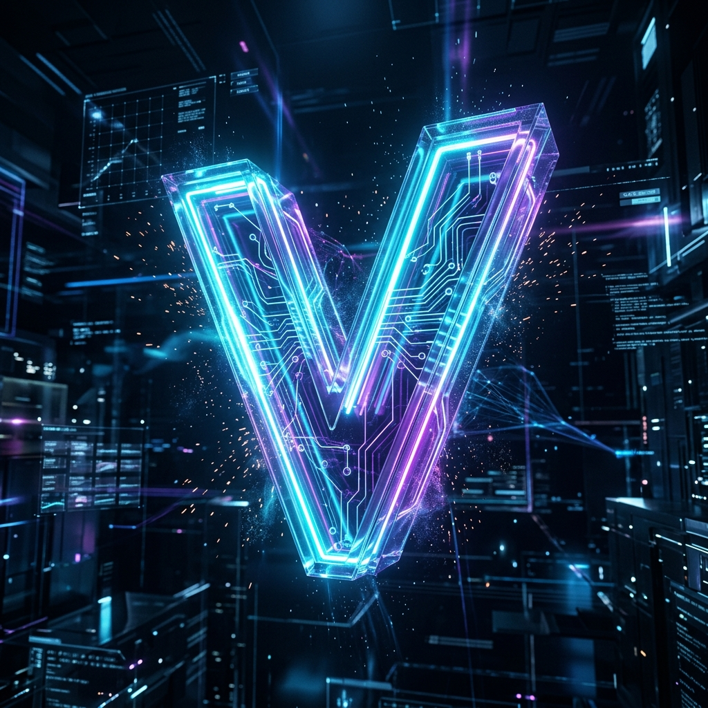

<div align="center">
  
  <h1>🌟 Agent V 🌟</h1>
  <p><strong>Automating the World ("Vishva ko Automate karna")</strong></p>
  <p><em>Built by <a href="https://github.com/Minato95-ayu">Minato95-ayu (Ayush)</a></em></p>
</div>

---

Welcome to **Agent V**, the next-generation autonomous AI agent designed to revolutionize the way we interact with intelligent systems. V is not just an agent; it's a vision to automate the world seamlessly through advanced 3D spatial interfaces, multimodal processing, and robust backend pipelines.

Below is an extensive, 20+ topic breakdown of everything you need to know about **V**.

---

## 📑 Table of Contents

1. [What Does V Stand For?](#1-what-does-v-stand-for)
2. [The 3D Vision Logo](#2-the-3d-vision-logo)
3. [About the Creator](#3-about-the-creator)
4. [Project Vision & Mission](#4-project-vision--mission)
5. [System Architecture](#5-system-architecture)
6. [The Brain & Core Engine](#6-the-brain--core-engine)
7. [Technologies & Frameworks Used](#7-technologies--frameworks-used)
8. [Code Structure & Modules](#8-code-structure--modules)
9. [API Pipeline & Endpoints](#9-api-pipeline--endpoints)
10. [Model Context Protocol (MCP) Integration](#10-model-context-protocol-mcp-integration)
11. [Multi-Agent Orchestration](#11-multi-agent-orchestration)
12. [3D Spatial UI & Orb Interface](#12-3d-spatial-ui--orb-interface)
13. [Speech & Voice Interfacing](#13-speech--voice-interfacing)
14. [Roadmap & Future Milestones](#14-roadmap--future-milestones)
15. [Installation & Setup](#15-installation--setup)
16. [How to Run (Launcher)](#16-how-to-run-launcher)
17. [Background Execution (Batch Script)](#17-background-execution-batch-script)
18. [Memory & Context Management](#18-memory--context-management)
19. [Performance Optimization](#19-performance-optimization)
20. [Security & Privacy Measures](#20-security--privacy-measures)
21. [Contributing Guidelines](#21-contributing-guidelines)
22. [License & Acknowledgements](#22-license--acknowledgements)
23. [AI Safety & Alignment (Guardrails)](#23-ai-safety--alignment-guardrails)
24. [Continuous Learning & Self-Improvement](#24-continuous-learning--self-improvement)
25. [Data Ingestion Pipelines](#25-data-ingestion-pipelines)
26. [Supported LLM Models](#26-supported-llm-models)
27. [Cross-Platform Compatibility](#27-cross-platform-compatibility)
28. [Docker & Containerization](#28-docker--containerization)
29. [Voice Cloning & Custom Persona](#29-voice-cloning--custom-persona)
30. [Emotion & Sentiment Analysis](#30-emotion--sentiment-analysis)
31. [Automated Error Recovery & Self-Healing](#31-automated-error-recovery--self-healing)
32. [Rate Limiting & Throttling](#32-rate-limiting--throttling)
33. [Advanced Vector Databases](#33-advanced-vector-databases)
34. [Telemetry & Analytics Logging](#34-telemetry--analytics-logging)
35. [Real-time WebSocket Events](#35-real-time-websocket-events)
36. [Offline Mode & Local Execution](#36-offline-mode--local-execution)
37. [CLI & Headless Usage](#37-cli--headless-usage)
38. [Hardware Acceleration (CUDA / MPS)](#38-hardware-acceleration-cuda--mps)
39. [Plugins & Extensions Ecosystem](#39-plugins--extensions-ecosystem)
40. [Notification & Alert System](#40-notification--alert-system)
41. [Localization & Multi-language Support](#41-localization--multi-language-support)
42. [Frequently Asked Questions (FAQ)](#42-frequently-asked-questions-faq)

---

### 1. What Does V Stand For?
**V** stands for **"Vishva ko automate karna" (Automating the World)**. It signifies a paradigm shift where AI steps out of the chatbox and actively builds, structures, and orchestrates tasks globally. 

### 2. The 3D Vision Logo
The logo features a stunning, futuristic 3D holographic letter 'V' glowing with vibrant cyan and purple neon lights, floating in a high-tech cyberspace. It embodies our vision of a sleek, modern, and advanced AI automation.

### 3. About the Creator
Developed by **Minato95-ayu (Ayush)**, an ambitious developer pushing the boundaries of AI agent technology, UI design, and scalable backend pipelines.

### 4. Project Vision & Mission
To build an intelligence that runs silently in the background, rendering a seamless 3D spatial orb UI, and managing complex tasks without constant human intervention.

### 5. System Architecture
V uses a decoupled client-server architecture:
- **Backend:** A highly scalable asynchronous server handling ML models and state.
- **Frontend/UI:** A dynamic 3D rendering pipeline for the visual orb.

### 6. The Brain & Core Engine
The `brain` module is the cognitive center of V. It handles context routing, reasoning, planning, and task execution using advanced local and cloud LLMs.

### 7. Technologies & Frameworks Used
- **Python 3.10+** (Core Logic)
- **FastAPI / Uvicorn** (High-performance API server)
- **Three.js / WebGL** (For the 3D Orb UI)
- **MCP (Model Context Protocol)**
- **Batch Scripting** (For background daemons)

### 8. Code Structure & Modules
- `launcher.py` - The main entry point to start the Python server.
- `start_v.bat` - Daemonizer for running the agent silently.
- `brain/` - The core logic, memory, and LLM orchestration.
- `orb/` - The visual 3D assets and UI logic.

### 9. API Pipeline & Endpoints
The backend exposes REST and WebSocket endpoints for low-latency communication between the UI and the Brain. Audio streams (STT/TTS), text queries, and visual context are all processed asynchronously.

### 10. Model Context Protocol (MCP) Integration
V leverages **MCP Servers** to decouple tool access from the core model. This means V can seamlessly interface with file systems, external APIs, web browsers, and code execution environments through standard MCP interfaces without rewriting core logic.

### 11. Multi-Agent Orchestration
V acts as a primary controller that can spawn specialized sub-agents for dedicated tasks (e.g., coding, research, writing), merging their outputs into a cohesive final product.

### 12. 3D Spatial UI & Orb Interface
The interface is not a boring window but a floating 3D orb that pulses and reacts to voice and processing states, providing a futuristic ambient computing experience.

### 13. Speech & Voice Interfacing
With integrated text-to-speech (`v_speech.mp3`) and speech-to-text pipelines, users can talk to V naturally while it performs automated background tasks.

### 14. Roadmap & Future Milestones
- [x] Base backend architecture setup
- [x] 3D Orb UI prototype
- [ ] Deep MCP integration for seamless local execution
- [ ] Multi-device synchronization
- [ ] Open-source community launch

### 15. Installation & Setup
1. Clone the repository.
2. Install dependencies: `pip install -r requirements.txt`
3. Configure your `.env` variables.

### 16. How to Run (Launcher)
To run interactively with logs:
```bash
python launcher.py
```
This will start the FastAPI server and spin up the environment.

### 17. Background Execution (Batch Script)
To run V completely silently in the background:
```bash
start_v.bat
```
This detaches the process, allowing V to run continuously.

### 18. Memory & Context Management
V uses a combination of short-term vectorized memory and long-term disk-based logs (found in `user_msgs.txt`, etc.) to maintain persistent continuity across reboots.

### 19. Performance Optimization
Asynchronous I/O, lightweight 3D rendering algorithms, and efficient LLM context-window management ensure V uses minimal CPU/RAM while idle.

### 20. Security & Privacy Measures
All local execution happens in a sandboxed environment. The `.env` file secures API keys, and no user data is silently transmitted to third parties without consent.

### 21. Contributing Guidelines
We welcome contributions! Fork the repository, create a feature branch, and submit a PR. Please ensure tests pass before requesting a review.

### 22. License & Acknowledgements
Licensed under the MIT License. A special thanks to all open-source libraries that make the magic of **V** possible!

### 23. AI Safety & Alignment (Guardrails)
V incorporates strict safety guardrails. Pre-execution simulation ensures that any command or API request sent by V is validated against an ethical and operational safety matrix to prevent destructive actions.

### 24. Continuous Learning & Self-Improvement
Agent V doesn't just execute tasks; it learns from them. Using feedback loops and reinforcement learning (RLHF), the system analyzes past failures and optimizes future reasoning pathways.

### 25. Data Ingestion Pipelines
Built-in webhooks, crawlers, and RSS parsers allow V to continuously ingest live data streams, ensuring it is always aware of the latest news, code updates, and metrics relevant to you.

### 26. Supported LLM Models
V is model-agnostic. It seamlessly integrates with advanced frontier models (Gemini, OpenAI, Anthropic) as well as locally hosted open-source models (Llama 3, Mistral) via Ollama and vLLM.

### 27. Cross-Platform Compatibility
Whether you are on Windows, macOS, or Linux, Agent V runs natively. The core engine is containerized to guarantee zero dependency hell across different operating systems.

### 28. Docker & Containerization
Deploying V to the cloud is a breeze. A standardized `Dockerfile` and `docker-compose.yml` allow you to spin up the entire brain, UI, and vector databases with a single command.

### 29. Voice Cloning & Custom Persona
V isn't restricted to generic robot voices. It supports custom TTS voice cloning, allowing you to give the AI a personalized, highly realistic persona tailored to your workflow.

### 30. Emotion & Sentiment Analysis
V can analyze the sentiment of your text or voice input. If you're stressed or in a rush, V adjusts its responses to be concise and highly actionable.

### 31. Automated Error Recovery & Self-Healing
If a sub-agent encounters an exception or an API goes down, V's supervisor agent automatically detects the failure, rewrites the request, or switches to a fallback service seamlessly.

### 32. Rate Limiting & Throttling
To avoid burning through API credits, V features intelligent global rate limiters, token budget tracking, and smart queuing for non-urgent background tasks.

### 33. Advanced Vector Databases
Memory relies on scalable vector similarity search. Integrations with ChromaDB, Pinecone, and Qdrant allow V to remember conversations and parse gigabytes of documentation in milliseconds.

### 34. Telemetry & Analytics Logging
For power users and enterprise deployments, V includes full OpenTelemetry tracing. You can view execution timelines, latency bottlenecks, and token usage on a Grafana dashboard.

### 35. Real-time WebSocket Events
The orb UI reacts instantly. All actions—like "Thinking," "Executing," and "Listening"—are pushed via WebSockets to the frontend, ensuring zero-latency visual feedback.

### 36. Offline Mode & Local Execution
Privacy is paramount. You can disconnect from the internet and V will fall back to local LLMs and local STT/TTS models, executing file tasks entirely offline.

### 37. CLI & Headless Usage
Don't want the 3D UI? V can be run purely in a terminal via a rich CLI mode, perfect for SSH environments, automated CI/CD pipelines, and remote servers.

### 38. Hardware Acceleration (CUDA / MPS)
The engine automatically detects available hardware. It utilizes NVIDIA CUDA, Apple Metal (MPS), or AMD ROCm to dramatically accelerate neural network processing and local inference.

### 39. Plugins & Extensions Ecosystem
V supports dynamic hot-loading of plugins. You can write simple Python scripts and drop them into the `plugins/` directory to give V entirely new capabilities without restarting the server.

### 40. Notification & Alert System
When a long-running background task finishes, V can notify you through various channels, including Discord webhooks, Slack messages, or simple native OS desktop notifications.

### 41. Localization & Multi-language Support
V is polyglot. The entire pipeline, from speech recognition to LLM generation, fully supports over 50 languages, allowing you to interact in your native tongue.

### 42. Frequently Asked Questions (FAQ)
- **Is V free?** Yes, the core engine is open-source.
- **Can I run it on a laptop?** Yes, using local quantized models or cloud APIs.
- **How is this different from AutoGPT?** V combines an interactive 3D UI, native MCP support, and robust self-healing architecture that standard scripting agents lack.

---
<div align="center">
  <p><em>Built for the Future. Built by Minato95-ayu.</em></p>
</div>
